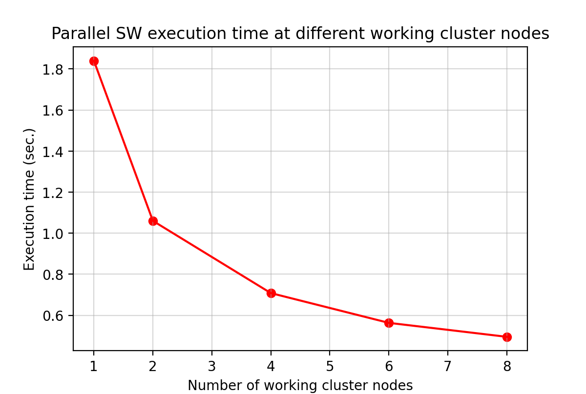

# Parallel Smith-Waterman Algorithm

> Reference:
>
> H. Khaled, H. M. Faheem, M. Fayez, I. Katib and N. R. Aljohani, "Performance improvement of the parallel smith waterman algorithm implementation using Hybrid MPI-OpenMP model," 2016 SAI Computing Conference (SAI), 2016, pp. 1232-1234, doi: 10.1109/SAI.2016.7556136.

## How to use

- Compile the project

  ```
  g++ -fopenmp ./*.cpp -o parallel_SW
  ```

- Run the program

  There are different modes of this program:

  1. interactive mode----Input the parameters manually to run the program

     ```
     ./parallel_SW.exe [--interactive]
     ```

  2. file mode----Generate files for drawing chart

     ```
     ./parallel_SW.exe --file
     ```

  3. help mode----Show the correct usage of the command

     ```
     ./parallel_SW.exe --help
     ```

- Show the line chart

  ```
  ./Line_Chart.py
  ```

  